# Hand-in: short report

## Technical problems during installation and use of MongoDB and how I resolved them

When I was going to verify the integrity of the MongoDB Packages, I encountered an issue. The provided PGP signature did not work on my macOS, so I had to use the SHA-256 checksum. Due to PGP being the alternative listed first on the page, it was the first one I tried. However, it did not work. I didn't understand why it did not work, so I spent quite a long time trying to get it to work. I would have wished that this would have been stated in the assignment because then I wouldn't have wasted so much time trying to get the PGP alternative to work out. Also, I know about other students who encountered the same issue as I did. Since they also have a macOS, I believe this is a problem for all Macbook/Apple-users.

To me it also was not clear how I should do the tutorials for the CRUD operations we were supposed to follow in Experiment 1. I had to look it up on Youtube before I realised that we were supposed to paste the snippets of code into our terminal. I believe that a part of my confusion was because I thought that the tutorial was somewhat similar to the interactive tutorial given in the beginning of the assignment, and therefore expected the tutorials on the CRUD operations to be of the same kind. Luckily, all of my confusions was temporary and I managed to do the entire assignment (I believe) without having any pending issues I did not get to resolve.

## Correct validation of the installation package (https://www.mongodb.com/docs/manual/tutorial/verify-mongodb-packages/)

The image below shows how we were supposed to verify the installation package:

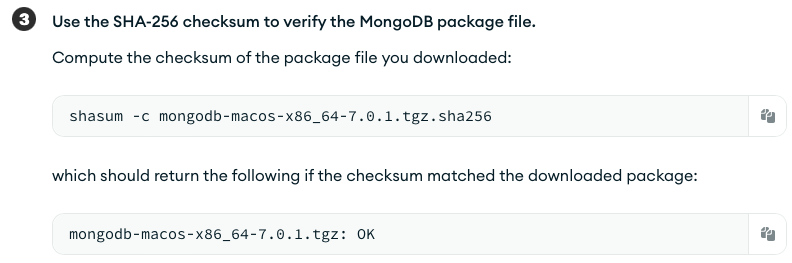

This screenshot displays the correct checksum, based on the instructions:

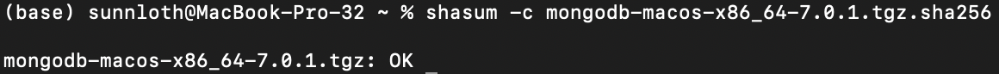

## Experiment 1 Relevant results

### Insert Documents

The following code showcases all documents in the inventory collection.

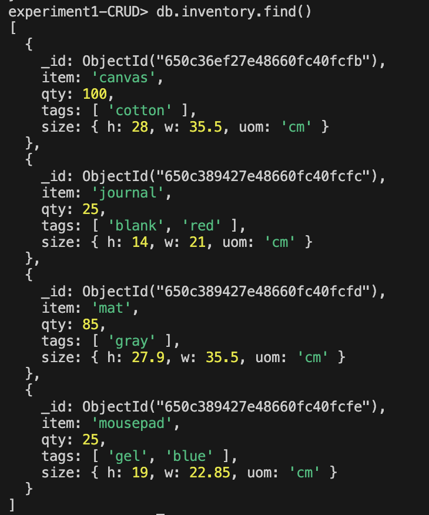

The `canvas` document was added using the `db.collection.insertOne()` operation.
The `journal`, `mat`, and `mousepad` document eas added using the `db.collection.insertMany()` operation.

An example of the insert operation, here `db.collection.insertMany()` is displayed below:

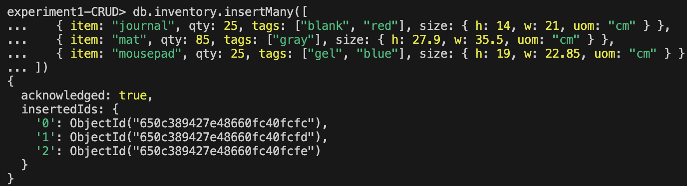

I ended up changing the name of this collection to `inventory_insertDoc`, and will use the same type of naming convention for all examples of the CRUD operations (insert, query, update, remove, bulk-write). That way I learned that MongoDB collections cannot be directly renamed using a built-in command. So in my case I did the following:

- Created the new collection with the desired name: `db.createCollection("inventory_insertDoc")`
- Copy the data from the inventory collection to the inventory_insertDoc collection: `db.inventory_insertDoc.insertMany(db.inventory.find().toArray())`
- Then I verified that the new collection contained all of the documents by using the find() operation.
- After I had verified that the data had been successfully transferred to the new collection, I could drop the old collection.

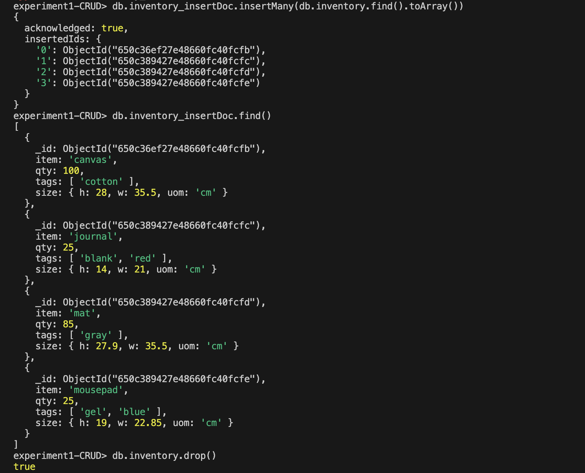

### Query Documents

**Specify the `Equality` condition**

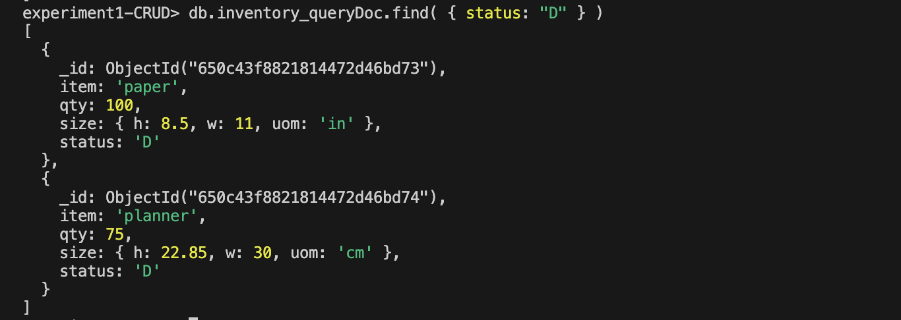

**Specify conditions using `Query operators`**

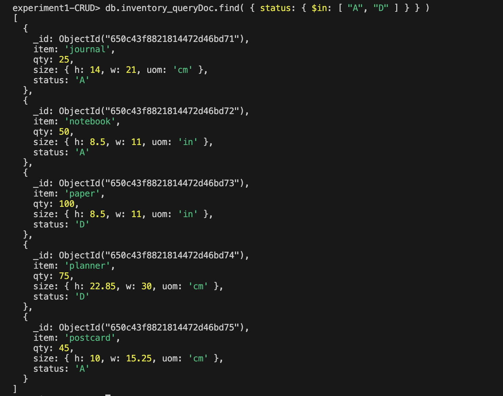

**Specify `And` operations**

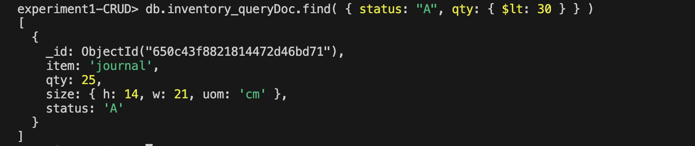

**Specify `Or` conditions**
($lt means less than)

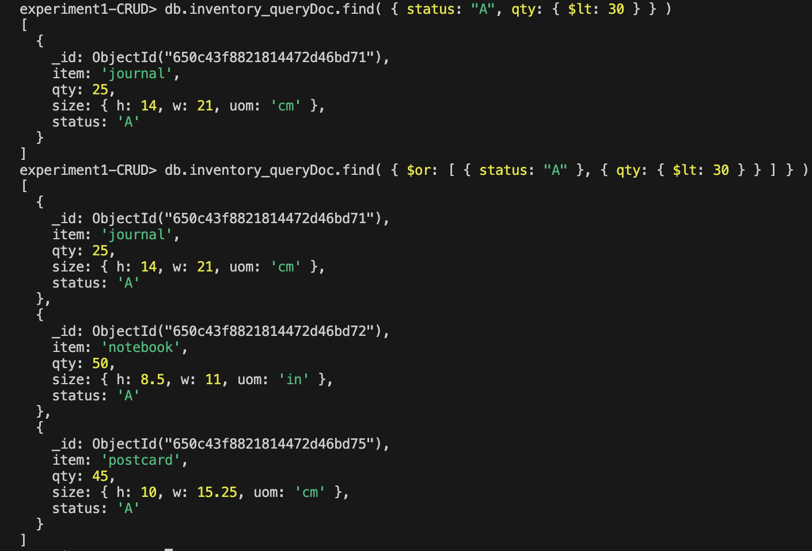

**Specify `And` as well as `Or` conditions**
(item: /^p/ means item that starts with the character p)

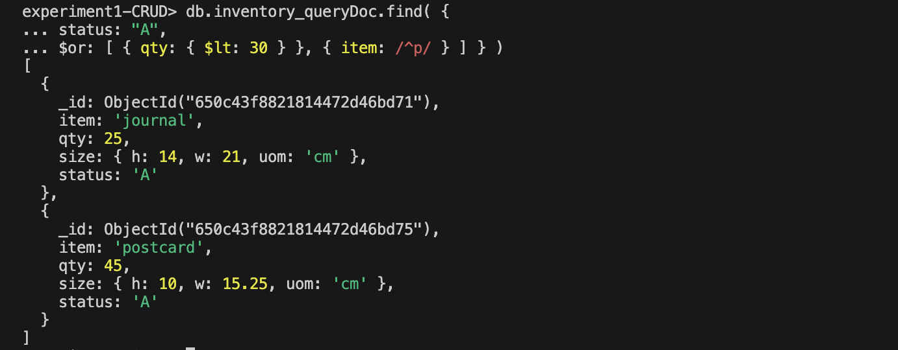

### Update Documents

**Update a single document**

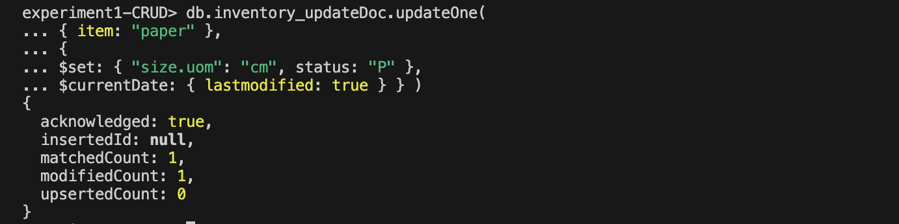

- the `$set` operator updates the value of the `size.uom` field to `"cm"` and the value of the status field to `"P"`.
- the `$currentDate` operator updates the value of the `lastModified` field to the current date. If the `lastModified` field does not exist, `$currentDate` will create the field.

**Update many documents**

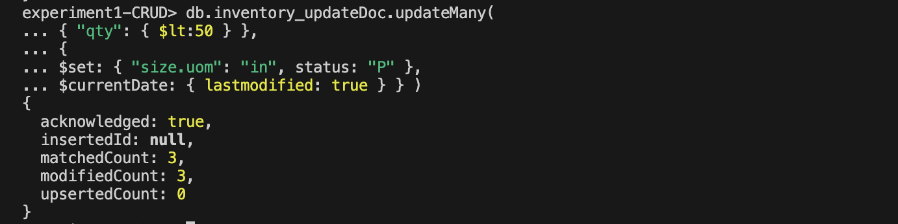

- the `$set` operator updates the value of the `size.uom` field to `"in"` and the value of the status field to `"P"`.
- the `$currentDate` operator updates the value of the `lastModified` field to the current date. If the `lastModified` field does not exist, `$currentDate` will create the field.

**Replace one**

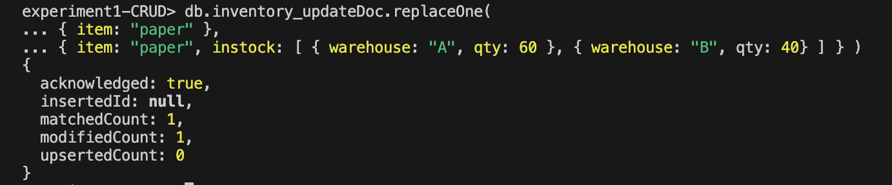
Check to see that the paper actually was replaced:

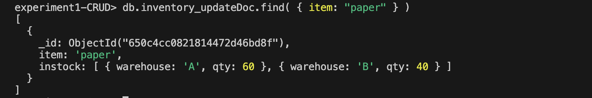

### Remove Documents

**Delete all documents matching a deleting criteria**

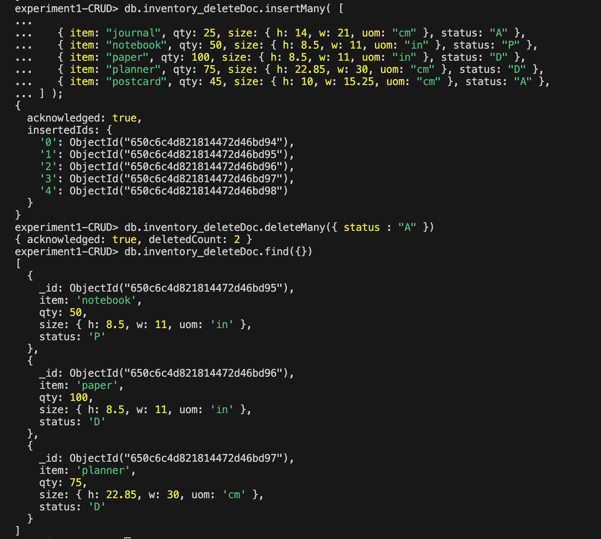

**Delete at most a single document that matches a deleting criteria**

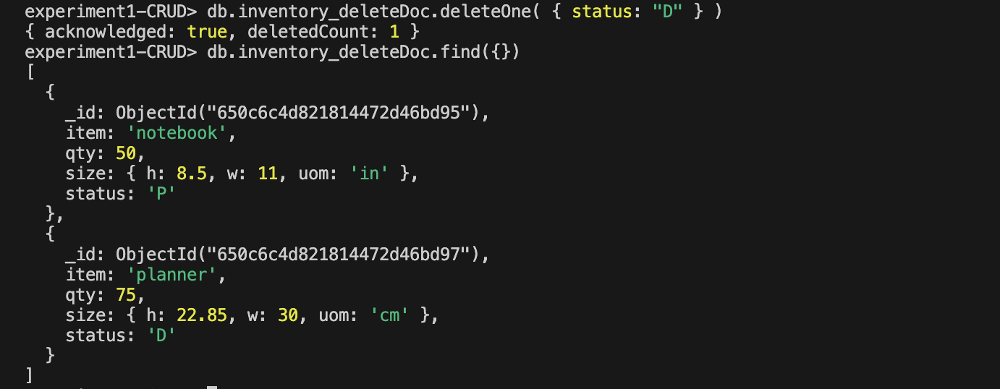

**Delete all documents**

### Bulk-Write operations

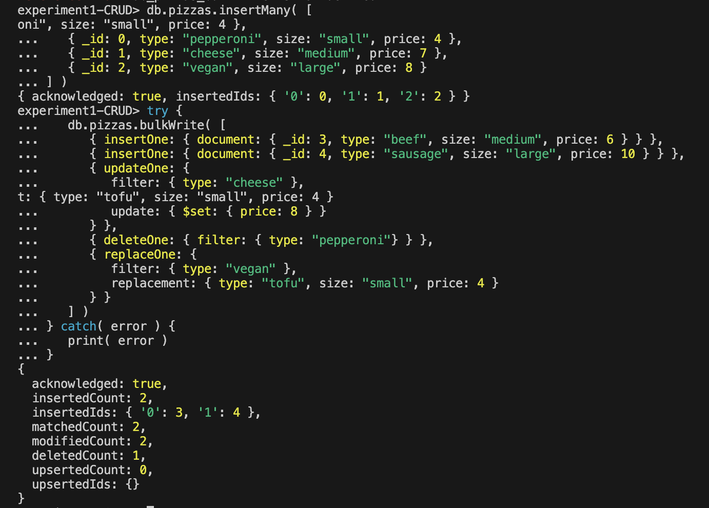

- Adds two documents using `insertOne`.
- Updates a document using `updateOne`.
- Deletes a document using `deleteOne`.
- Replaces a document using `replaceOne`.

## Experiment 2 Example working with Map-reduce

### Return the total Price Per Customer

Perform the map-reduce operation on the `orders_mapReduce` collection to group by the `cust_id` and calculate the sum of the `price` for each `cust_id`:

1. Define the map function to process each input document:

1. Define the corresponding reduce function with two arguments `keyCustId` and `valuesPrices`:

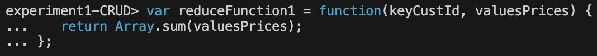

1. Perform Map-reduce on all documents in the `orders_mapReduce` collection using the `mapFunction1` map function and the `reduceFunction1` reduce function:

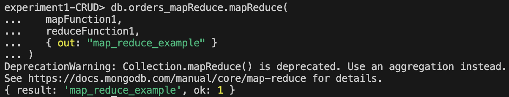

This operation should output the results to a collection named `map_reduce_example`. If the `map_reduce_example` collection already exists, the operation will replace the contents with the results of this map-reduce operation.

In my case, I got the message that the `Collection.mapReduce()` method is deprecated in MongoDb, and it suggests using aggregation instead.

1. I was still able to query the `map_reduce_example` collection to verify the results, as the operation returned these documents: 

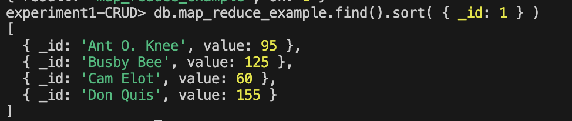

## Additional Map-reduce operation developed by me

I took inspiration from my part-time job, as I work as a sales associate at a jewelry store. 

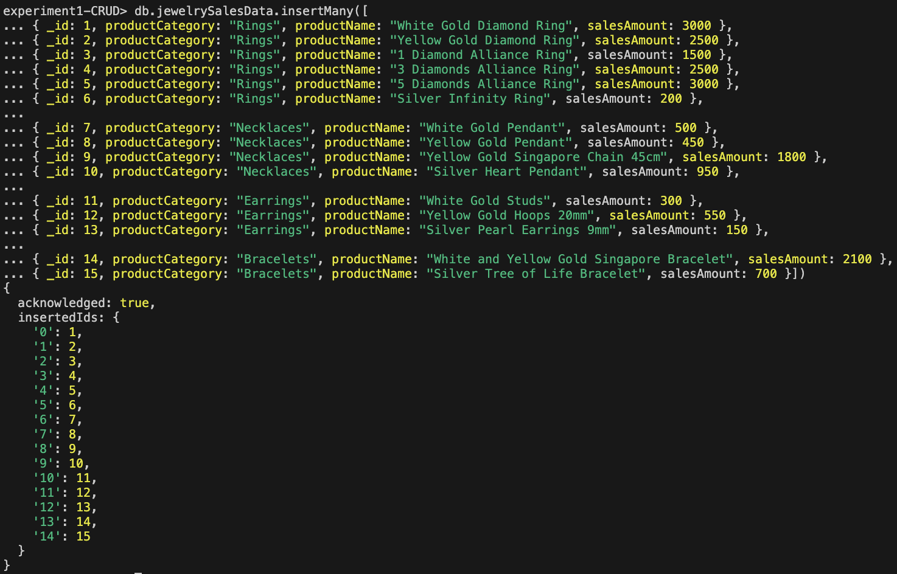

Map function:

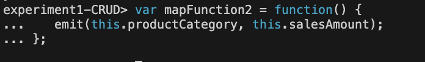

Reduce function:

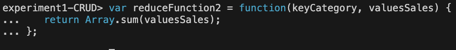

The results:
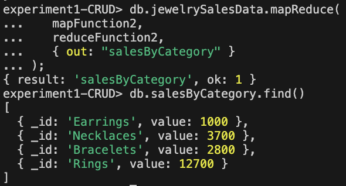

In this output we can see the total sales revenue for each jewelry product category, such as `Earrings`, `Necklaces`, `Bracelets` and `Rings`. These results confirm that the Map-reduce operation has correctly aggregated and summarized the sales data for each jewelry product category in the `jewelrySalesData` collection. In this example, the Map-reduce function is useful because you can use it to get an overview over the sales data in a store, which can further be used in analysis of the store or for reporting purposes.

