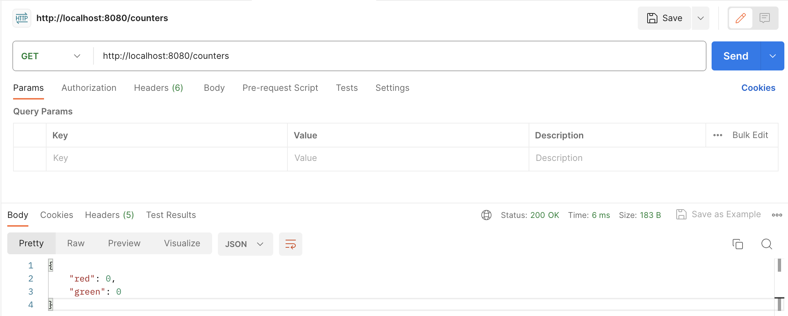

# Hand-in: short report

## URL-link to the code for experiment 2
https://github.com/h591296/DAT250-Spring-Counters-Todos.git

## Experiment 1

I know it's not requried but here is a screenshot for the GET operation in Postman:

And here is a screenshot for the PUT and final GET operation in Postman:

## Technical problems

I did not encounter any other technical difficulties, other than that I weren't able to run the spring project at first. I resolved this issue by using a different button to run it.